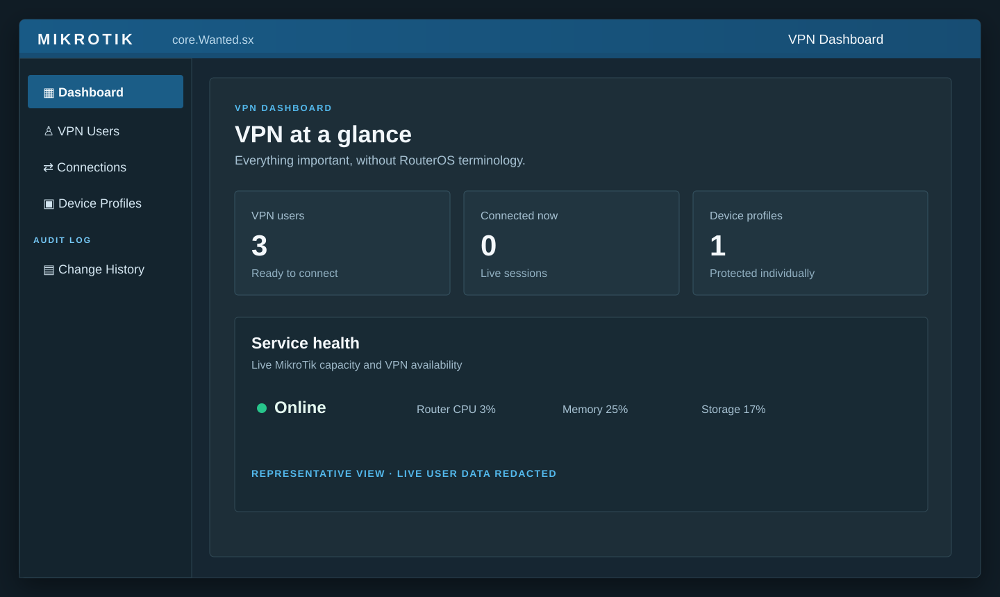
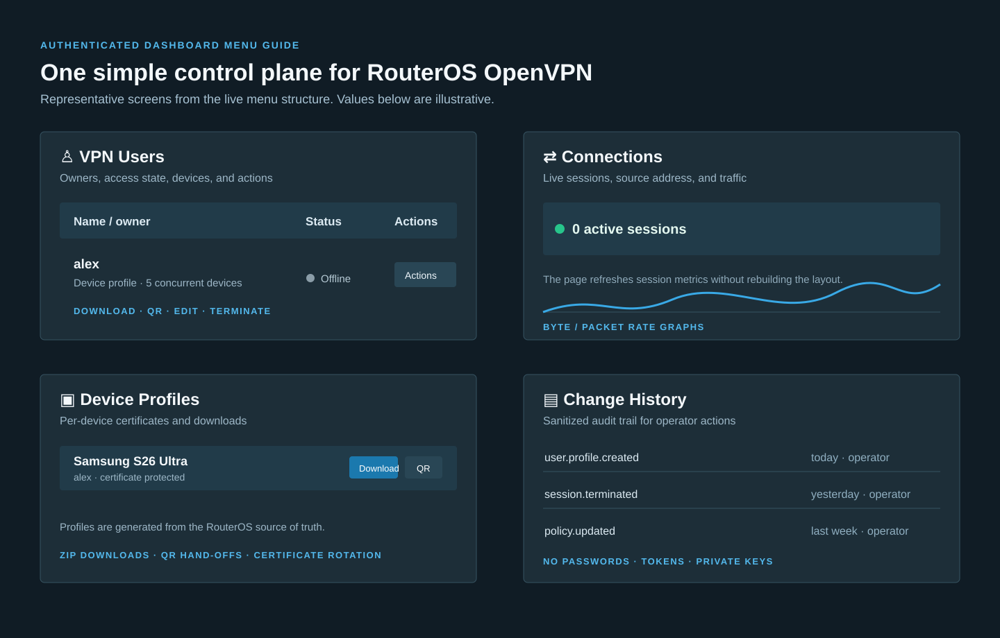
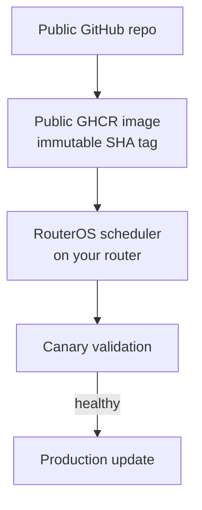
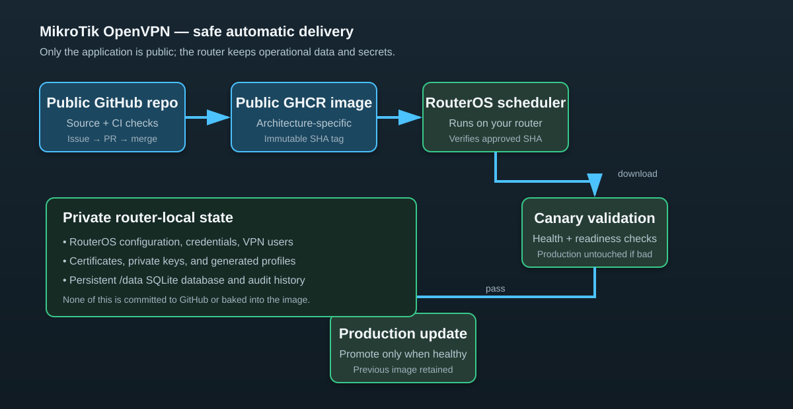

# MikroTik OpenVPN GUI

[](https://github.com/aivanov2-godaddy/mikrotik-openvpn-gui/actions/workflows/ci.yml)

MikroTik OpenVPN GUI is a self-hosted, WinBox-inspired control plane for an
OpenVPN service on RouterOS 7. It is not a visual-only UI: it deploys the
dashboard container, validates the router connection, and applies the selected
user, device-profile, policy, rate-limit, schedule, and access changes through
RouterOS while RouterOS remains the source of truth for identities,
certificates, sessions, and traffic policy.

> [!IMPORTANT]
> The current installer provisions and configures the dashboard around an
> existing RouterOS OpenVPN server, PPP profile, and CA. For an otherwise empty
> supported router, the optional **OpenVPN foundations** planner can generate a
> reviewable CA, server-certificate, address-pool, PPP-profile, and OpenVPN
> server plan. It never applies commands automatically, changes the normal
> installation path, or stores secrets in the public project. Review every
> generated RouterOS command before applying it and test on an isolated canary
> device where practical.

## Highlights

- Authenticate administrators against RouterOS; no second dashboard-password database.
- Add, edit, suspend, duplicate, and remove VPN users.
- Issue separate client certificates and password-protected profile archives per device.
- Onboard phones and tablets with short-lived QR hand-offs or ZIP downloads.
- Inspect active sessions, traffic counters, source addresses, and connection history.
- Apply simple access presets: device limits, expiry, schedule, speed, DNS, and quota.
- Reuse built-in or custom policy templates; preview selected users before an auditable, checkpointed apply.
- Review one read-only service-health view for RouterOS REST, OpenVPN, profile issuing, certificate, storage, and capacity readiness with safe next steps.
- Keep dashboard metadata and sanitized audit events in SQLite; do not store VPN passwords or private keys.
- Deploy the same image on supported RouterOS container architectures: `arm64` is the validated target and `amd64` is available for CHR/x86 evaluation.

## Dashboard preview

Representative mock-data views show the dashboard navigation and main operator
screens. They contain no production accounts, addresses, or credentials.





## Deployment architecture

The project separates public software delivery from private VPN operation. The
router scheduler is the deployment controller: it selects an immutable image,
validates it in canary, and promotes it to production only after the checks
pass. RouterOS remains the system of record for configuration, identities,
certificates, sessions, and audit data.





The scheduler operates against the router-local persistent mounts, so private
configuration, VPN data, certificates, and audit history never enter GitHub or
the public image.

### What stays private

- RouterOS credentials, environment values, domains, addresses, and Cloudflare settings.
- VPN users, certificates, private keys, generated profiles, SQLite data, and audit history.
- The controller's approved image digest and deployment state.

### What is public

- Source code, documentation, tests, and architecture-neutral container builds.
- The GHCR image and its immutable release metadata; no router-specific
  configuration is baked into the image.

The router-local controller never follows a mutable branch or tag. It keeps the
previous image and persistent mounts available for rollback, and a failed
canary or readiness check leaves production untouched. See
[ROUTER_LOCAL_AUTOMATION.md](docs/ROUTER_LOCAL_AUTOMATION.md) for the exact
promotion and rollback procedure.

## Quick start

1. Check the [supported RouterOS platform requirements](docs/INSTALLATION.md#1-check-the-platform).
2. Run the offline [Installation Wizard](docs/INSTALL_WIZARD.md) and follow the [first-time installation guide](docs/INSTALLATION.md) to enable Container mode, create storage/networking, configure RouterOS REST trust, and start an immutable image.
3. Expose the dashboard safely with the [HTTPS and reverse-proxy guide](docs/EXPOSURE.md). Direct TLS, a normal DNS name, local-only access, and optional Cloudflare are supported.
4. Use the dashboard’s setup plan generator or [manual update guide](docs/DEPLOYMENT.md) for later image updates.

The public repository publishes architecture-specific GHCR images from `main`.
Always pin an immutable `sha-<commit>-<architecture>` tag for RouterOS; never
make a router follow the mutable `edge` tag automatically.

## Runtime configuration

Set values through a RouterOS container environment list. Never commit a
populated environment file.

| Variable | Required | Description |
| --- | --- | --- |
| `PUBLIC_ORIGIN` | Yes | Public HTTPS origin, for example `https://vpn.example.com` |
| `ROUTEROS_REST_URL` | Yes | RouterOS REST base URL ending in `/rest` |
| `ROUTEROS_CA_FILE` | Yes | CA file used to verify RouterOS REST, recommended `/config/routeros-ca.crt` |
| `ROUTEROS_INSECURE_TLS` | Yes | Keep `false` in production |
| `DATABASE_PATH` | Yes | Persistent SQLite path, recommended `/data/dashboard.sqlite` |
| `HISTORY_RETENTION_DAYS` | No | Keep sanitized dashboard audit and completed connection history for 30–3650 days; defaults to 365. It never deletes RouterOS configuration or active sessions. |
| `APP_PORT` | No | Dashboard listener; defaults to `8080` |
| `REDIRECT_PORT` | No | HTTP redirect listener; defaults to `8081` |
| `DROP_PRIVILEGES` | Yes | Keep `true` so the app drops to an unprivileged UID/GID |
| `RUN_UID`, `RUN_GID` | No | Runtime identity; both default to `65534` |
| `WEBHOOK_URL` | Optional | HTTPS endpoint for sanitized, signed audit events; disabled unless paired with `WEBHOOK_SIGNING_SECRET` |
| `WEBHOOK_SIGNING_SECRET` | Optional | At least 32 characters; used only to calculate `X-VPN-Dashboard-Signature` and never displayed or audited |
| `TRUST_CLOUDFLARE` | Conditional | Enable only when every request reaches the app through a trusted Cloudflare origin proxy |
| `TRUSTED_PROXY_SOURCES` | Conditional | Private proxy addresses allowed to set forwarded client headers |
| `OVPN_PPP_PROFILE` | Yes for profile issuing | Existing RouterOS PPP profile for new OpenVPN users |
| `OVPN_SERVER_NAME` | Yes for profile issuing | Existing RouterOS OpenVPN server name |
| `OVPN_CA_NAME` | Yes for profile issuing | Existing RouterOS CA used to sign client certificates |
| `OVPN_HOST` | Yes for profile issuing | Public OpenVPN DNS name or IP written into device profiles |
| `OVPN_SERVER_IDENTITY` | No | Certificate identity verified by profiles; defaults to `OVPN_HOST` |
| `VPN_LAN_CIDR` | Yes for LAN/full-tunnel profiles | IPv4 LAN route included in generated profiles |
| `VPN_ROUTER_DNS` | Yes for RouterOS-DNS profiles | Router DNS server written into generated profiles |
| `DASHBOARD_NAME`, `ROUTER_DISPLAY_NAME` | No | Optional presentation labels; generic defaults are used |

Read-only router status remains available without the `OVPN_*` settings. User
and profile actions fail closed until the OpenVPN topology is configured.

## Development

The runtime uses the Python standard library. To validate a checkout:

```powershell
python -m pip install pre-commit
python -m pre_commit install
python -m pre_commit run --all-files
python scripts/check-secrets.py
python -m compileall -q app.py automation.py cloudflare.py deploy_routeros_canary.py deployment.py favicon.py icons.py install_routeros.py qr.py routeros.py security.py store.py templates.py update_routeros_app.py
python -m unittest discover -s tests -v
```

For a local UI backed by the bundled mock RouterOS service:

```powershell
python tests/run_mock_app.py --port 18080
```

Then open `http://127.0.0.1:18080`. The mock never contacts a router or a
Cloudflare account.

## Release and deployment boundary

This public repository builds public images and a generic release manifest. It
has no RouterOS credentials, self-hosted runner, production environment, or
remote router-deployment workflow. Operators can use the explicit local update
procedure in [docs/DEPLOYMENT.md](docs/DEPLOYMENT.md), or install the supported
router-local scheduler described in
[docs/ROUTER_LOCAL_AUTOMATION.md](docs/ROUTER_LOCAL_AUTOMATION.md). That
separation prevents a pull request or fork from directly modifying any router;
the router retains its own configuration, credentials, certificates, users, and
SQLite data.

See [docs/RELEASES.md](docs/RELEASES.md) for versioning and image tags,
[SECURITY.md](SECURITY.md) for reporting guidance, and
[CONTRIBUTING.md](CONTRIBUTING.md) to contribute.

The planned public releases are tracked in [docs/ROADMAP.md](docs/ROADMAP.md).

## License and trademarks

Licensed under the [Apache License 2.0](LICENSE). MikroTik and RouterOS are
trademarks of MikroTikls SIA. This project is independent and is not affiliated
with, endorsed by, or sponsored by MikroTikls SIA.
