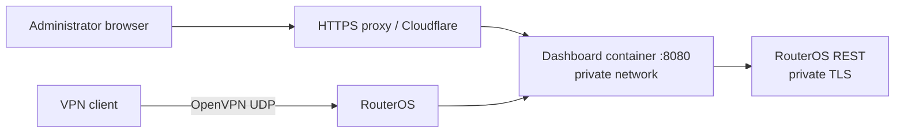

# Complete installation playbook

This playbook takes a new operator from a supported MikroTik router to a
verified MikroTik OpenVPN GUI installation. It uses only documentation ranges
and names:

| Placeholder | Example value | Replace with |
| --- | --- | --- |
| `<DASHBOARD_HOST>` | `vpn.example.com` | The browser hostname for the dashboard |
| `<OVPN_HOST>` | `ovpn.example.com` or `198.51.100.10` | The OpenVPN endpoint written into profiles |
| `<WAN_IP>` | `198.51.100.10` | Your router's public IPv4 address |
| `<DISK>` | `disk1` | Your external storage name from **Files** |
| `<ROUTER_REST_HOST>` | `router-rest.example.com` | A private or protected RouterOS REST TLS name |
| `<FULL_SHA>` | `0123456789abcdef...` | A full 40-character commit from a successful Publish workflow |

Never replace a placeholder with a password, private key, recovery code,
Cloudflare token, GitHub token, or exported configuration. Those values belong
only in the router or the service that uses them.

## Architecture and boundaries



The web dashboard and OpenVPN transport are distinct paths. Do **not** proxy
RouterOS REST or OpenVPN UDP through Cloudflare. Do **not** expose container
port 8080 or the RouterOS REST service directly to the public Internet.

## 1. Preflight and backup

### 1.1 Confirm platform support

In WinBox, open **System → Resources** and **System → Packages**. Capture the
RouterOS version and `architecture-name`, or run:

```routeros
/system/resource/print
/system/package/print
```

Proceed only with RouterOS 7 on `arm64` for a production router. The Container
package must match the exact RouterOS release and architecture.

### 1.2 Make recovery material first

Use WinBox **Files** to download an encrypted backup. Also create a redacted
export for your own review. Keep both offline; neither belongs in an issue, PR,
or this repository.

```routeros
/system/backup/save name=before-vpn-dashboard password="<choose-a-backup-password>"
/export hide-sensitive file=before-vpn-dashboard
```

### 1.3 Record existing OpenVPN objects

If OpenVPN already works, write down the server name, PPP profile, CA name,
public endpoint, LAN CIDR, and router DNS address. You will enter their names
into the router-local environment list later.

```routeros
/interface/ovpn-server/server/print detail
/ppp/profile/print
/certificate/print detail
```

Do not alter a working OpenVPN server during the dashboard installation.

## 2. Enable RouterOS Container support

### 2.1 Install the matching package

On RouterOS 7.18 and later, go to **System → Packages → Check for Updates**,
enable the disabled `container` package, choose **Apply Changes**, and reboot.
If it is not offered, download the *matching* extra package from the official
[MikroTik Packages page](https://help.mikrotik.com/docs/spaces/ROS/pages/40992872/Packages),
upload it through **Files**, then reboot.

Verify after boot:

```routeros
/system/package/print where name="container"
```

### 2.2 Enable device mode

Container mode is intentionally disabled by default on modern RouterOS.

```routeros
/system/device-mode/print
/system/device-mode/update container=yes
```

Follow RouterOS's displayed physical-confirmation instruction within its time
window (normally a mode/reset-button action or cold power cycle), then let the
router reboot. Recheck that `container: yes` appears. This cannot safely be
automated remotely.

## 3. Create isolated storage and networking

In **Files**, identify your external disk. Use external storage for image
roots, temporary extraction, the SQLite database, and configuration mounts.
Create the directories in WinBox Files or using your normal RouterOS storage
workflow:

```text
<DISK>/vpn-dashboard/root
<DISK>/vpn-dashboard/data
<DISK>/vpn-dashboard/config
<DISK>/containers/tmp
```

Choose a subnet that does not overlap your LAN, VPN address pool, or any
existing container subnet. This example uses `172.31.250.0/24`.

```routeros
/interface/bridge/add name=containers
/interface/veth/add name=veth-vpn-dashboard address=172.31.250.2/24 gateway=172.31.250.1
/ip/address/add address=172.31.250.1/24 interface=containers
/interface/bridge/port/add bridge=containers interface=veth-vpn-dashboard
/ip/firewall/nat/add chain=srcnat action=masquerade src-address=172.31.250.0/24 comment="VPN Dashboard container egress"
```

Verify the addresses and ensure the container subnet can resolve DNS and reach
GHCR over HTTPS. Do not add a WAN dst-NAT to port 8080.

## 4. Prepare RouterOS REST TLS and trust

The dashboard uses RouterOS REST over HTTPS. Configure only `www-ssl`, keep
plain `www` disabled, and restrict management access with firewall rules to the
dashboard container and approved administrator sources. The REST URL ends in
`/rest`, for example:

```text
https://<ROUTER_REST_HOST>:8443/rest
```

The TLS certificate's SAN must match `<ROUTER_REST_HOST>` exactly. Copy only the
**public CA certificate** needed to verify that service into
`<DISK>/vpn-dashboard/config/routeros-ca.crt`. Never copy a CA private key or
router service private key into the mount.

## 5. Generate and review an offline RouterOS plan

Clone or download this repository on an administrator workstation, then run:

```powershell
python install_routeros.py --interactive --output routeros-install.rsc
```

Choose `arm64`, enter only non-secret values, select the immutable commit SHA,
and review the resulting file in a text editor. The wizard is intentionally
offline and review-only.

The equivalent explicit example is:

```powershell
python install_routeros.py `
  --owner aivanov2-godaddy `
  --commit <FULL_SHA> `
  --architecture arm64 `
  --public-origin https://vpn.example.com `
  --routeros-rest-url https://router-rest.example.com:8443/rest `
  --routeros-rest-san router-rest.example.com `
  --external-root disk1/vpn-dashboard `
  --bridge containers `
  --container-address 172.31.250.2/24 `
  --gateway 172.31.250.1 `
  --ovpn-ppp-profile vpn-full-tunnel `
  --ovpn-server-name vpn-server `
  --ovpn-ca-name vpn-ca `
  --ovpn-host ovpn.example.com `
  --vpn-lan-cidr 192.168.88.0/24 `
  --vpn-router-dns 192.168.88.1 `
  --output routeros-install.rsc
```

### Stop and review

Before applying anything, confirm all names, addresses, storage paths, and
certificate names. The generated plan does **not** replace the backup, create
external-disk folders, add NAT, configure REST TLS/firewalls, copy the CA,
configure a reverse proxy, or make Cloudflare changes. Apply reviewed commands
one at a time in **WinBox → New Terminal**.

## 6. Configure registry, mounts, and environment

The public package needs no pull token. Configure the public registry and its
temporary extraction directory:

```routeros
/container/config/set registry-url=https://ghcr.io tmpdir="<DISK>/containers/tmp"
```

Create persistent mounts. The data mount preserves the database through image
updates; the configuration mount holds the public REST CA.

```routeros
/container/mounts/add list=vpn-dashboard-mounts src="<DISK>/vpn-dashboard/data" dst=/data
/container/mounts/add list=vpn-dashboard-mounts src="<DISK>/vpn-dashboard/config" dst=/config
```

Create a RouterOS environment list. Add the common values first:

```routeros
/container/envs/add list=vpn-dashboard-env key=DATABASE_PATH value=/data/dashboard.sqlite
/container/envs/add list=vpn-dashboard-env key=APP_PORT value=8080
/container/envs/add list=vpn-dashboard-env key=REDIRECT_PORT value=8081
/container/envs/add list=vpn-dashboard-env key=DROP_PRIVILEGES value=true
/container/envs/add list=vpn-dashboard-env key=ROUTEROS_REST_URL value="https://<ROUTER_REST_HOST>:8443/rest"
/container/envs/add list=vpn-dashboard-env key=ROUTEROS_CA_FILE value=/config/routeros-ca.crt
/container/envs/add list=vpn-dashboard-env key=ROUTEROS_INSECURE_TLS value=false
/container/envs/add list=vpn-dashboard-env key=OVPN_PPP_PROFILE value="<PPP_PROFILE>"
/container/envs/add list=vpn-dashboard-env key=OVPN_SERVER_NAME value="<OVPN_SERVER>"
/container/envs/add list=vpn-dashboard-env key=OVPN_CA_NAME value="<OVPN_CA>"
/container/envs/add list=vpn-dashboard-env key=OVPN_HOST value="<OVPN_HOST>"
/container/envs/add list=vpn-dashboard-env key=VPN_LAN_CIDR value="192.168.88.0/24"
/container/envs/add list=vpn-dashboard-env key=VPN_ROUTER_DNS value="192.168.88.1"
```

Add the exposure-specific `PUBLIC_ORIGIN`, proxy-trust, and label values in the
scenario you chose below. Do not set `ROUTEROS_INSECURE_TLS=true` just to make a
certificate error disappear; fix certificate identity and CA trust instead.

## 7. Pull an immutable image and start it

Find a full commit SHA from a successful **Publish container** workflow. Use
the architecture suffix. RouterOS resolves image names through the registry
configured above, so use the registry-relative name:

```routeros
/container/add name=vpn-dashboard remote-image=aivanov2-godaddy/mikrotik-openvpn-gui:sha-<FULL_SHA>-arm64 interface=veth-vpn-dashboard root-dir="<DISK>/vpn-dashboard/root" mountlists=vpn-dashboard-mounts envlists=vpn-dashboard-env start-on-boot=yes logging=yes
/container/print detail where name="vpn-dashboard"
/container/start [find name="vpn-dashboard"]
```

Wait for extraction to finish. A healthy container shows an `H` flag and a
good health-check state:

```routeros
/container/print detail where name="vpn-dashboard"
```

## Scenario A: domain, HTTPS, and optional Cloudflare

This is the recommended public deployment. Use different names for the
dashboard and VPN endpoint, for example `vpn.example.com` and
`ovpn.example.com`.

### A1. Point DNS at your public address

Create an A/AAAA record for `vpn.example.com` to `<WAN_IP>`. Do not publish a
record for RouterOS REST. Point `ovpn.example.com` to `<WAN_IP>` separately if
your OpenVPN clients use a hostname.

### A2. Run a TLS reverse proxy

The dashboard image intentionally serves HTTP on its private interface. Run a
maintained HTTPS reverse proxy on a host or dedicated proxy container that can
reach `172.31.250.2:8080`; it is not installed by this project. Caddy is one
simple example:

```caddyfile
vpn.example.com {
    reverse_proxy 172.31.250.2:8080
}
```

Persist Caddy's certificate storage. Permit TCP 443 only to the reverse proxy;
allow the proxy (and not the internet) to reach the dashboard's port 8080.

### A3. Configure dashboard trust for direct HTTPS

For a domain with no Cloudflare proxy, use the proxy's exact private address
as observed by the dashboard—never the visitor address or an entire LAN range:

```routeros
/container/envs/add list=vpn-dashboard-env key=PUBLIC_ORIGIN value=https://vpn.example.com
/container/envs/add list=vpn-dashboard-env key=TRUST_CLOUDFLARE value=false
/container/envs/add list=vpn-dashboard-env key=TRUSTED_PROXY_SOURCES value=172.31.250.3
/container/envs/add list=vpn-dashboard-env key=TRUSTED_PROXY_HEADER value=X-Forwarded-For
/container/envs/add list=vpn-dashboard-env key=ACCESS_LAYER_LABEL value="Direct HTTPS"
```

Use your actual proxy address instead of `172.31.250.3`.

### A4. Add Cloudflare only if wanted

Cloudflare is optional. If used, it fronts **only** `vpn.example.com`:

1. In Cloudflare DNS, create the `vpn` record and turn proxying on (orange
   cloud). Leave the OpenVPN UDP record DNS-only.
2. Configure SSL/TLS as
   [Full (strict)](https://developers.cloudflare.com/ssl/origin-configuration/ssl-modes/full-strict/).
   The proxy still needs a valid origin certificate.
3. Optionally create a Cloudflare Access self-hosted application for the
   dashboard hostname and add an explicit allow policy. Do not put an Access
   token in the router's environment list.
4. At the reverse-proxy perimeter, allow only current Cloudflare source ranges
   to public TCP 443. Obtain and maintain that list from Cloudflare's official
   [IP address documentation](https://developers.cloudflare.com/fundamentals/concepts/cloudflare-ip-addresses/),
   rather than copying a stale list into this guide.
5. Ensure requests reaching the dashboard come from the immediate private
   proxy, then configure it to pass `CF-Connecting-IP` unchanged.

Replace the three direct-HTTPS trust entries with:

```routeros
/container/envs/set [find list=vpn-dashboard-env key=TRUST_CLOUDFLARE] value=true
/container/envs/set [find list=vpn-dashboard-env key=TRUSTED_PROXY_SOURCES] value=172.31.250.3
/container/envs/set [find list=vpn-dashboard-env key=TRUSTED_PROXY_HEADER] value=CF-Connecting-IP
/container/envs/set [find list=vpn-dashboard-env key=ACCESS_LAYER_LABEL] value="Cloudflare Access"
```

`172.31.250.3` is still the immediate proxy address, not a Cloudflare range.
If the dashboard can be reached without that proxy, client headers could be
spoofed; fix the network boundary first.

Restart the dashboard after changing its environment list:

```routeros
/container/stop [find name="vpn-dashboard"]
/container/start [find name="vpn-dashboard"]
```

## Scenario B: IP-only OpenVPN and a secure dashboard

OpenVPN device profiles can use a public IP directly. Set `OVPN_HOST` to your
real IP and keep server identity verification enabled:

```routeros
/container/envs/set [find list=vpn-dashboard-env key=OVPN_HOST] value=198.51.100.10
/container/envs/add list=vpn-dashboard-env key=OVPN_SERVER_IDENTITY value="<exact-server-certificate-identity>"
```

Use the IP as `OVPN_SERVER_IDENTITY` only when the server certificate is
actually valid for that IP. Otherwise use the certificate's verified identity;
do not remove profile certificate verification.

For the **dashboard**, public plaintext HTTP is not supported. You have two
safe choices:

1. **Recommended:** keep management private (LAN or existing admin VPN) and
   use HTTPS with a private CA whose certificate contains the private dashboard
   IP in its SAN. Install that CA on every administrator device.
2. **Public IP dashboard:** obtain a certificate whose SAN contains the public
   IP address, run a TLS reverse proxy, and use `https://198.51.100.10` as
   `PUBLIC_ORIGIN`. Browser-trusted public IP certificates are not commonly
   available through ordinary ACME flows, which is why Scenario A is preferred.

For a direct IP HTTPS proxy at `198.51.100.10`, the environment is:

```routeros
/container/envs/add list=vpn-dashboard-env key=PUBLIC_ORIGIN value=https://198.51.100.10
/container/envs/add list=vpn-dashboard-env key=TRUST_CLOUDFLARE value=false
/container/envs/add list=vpn-dashboard-env key=TRUSTED_PROXY_SOURCES value=172.31.250.3
/container/envs/add list=vpn-dashboard-env key=TRUSTED_PROXY_HEADER value=X-Forwarded-For
/container/envs/add list=vpn-dashboard-env key=ACCESS_LAYER_LABEL value="Private IP HTTPS"
```

Do not put an IP-only dashboard behind Cloudflare; Cloudflare's normal browser
TLS and hostname model expects a hostname. Do not expose `:8080` as a shortcut.

## 8. Validate before adding users

From the management network, confirm health first:

```powershell
curl.exe -fsS http://172.31.250.2:8080/healthz
curl.exe -fsS http://172.31.250.2:8080/readyz
```

Then open the chosen HTTPS `PUBLIC_ORIGIN` and sign in through the configured
perimeter with an authorized RouterOS account. Verify:

1. **Dashboard** shows the router as online.
2. **Service Health** has no RouterOS REST trust error.
3. **VPN Users** shows the expected existing users, if any.
4. A test user/profile can be created and downloaded only after you confirm
   the OpenVPN object names are correct.
5. The test device connects successfully and appears under **Connections**.
6. A controlled router reboot returns the dashboard because `start-on-boot=yes`.


## New router: create an OpenVPN foundation plan

If this router has no OpenVPN server, open **Setup Planner → OpenVPN
foundations** after dashboard login. It performs a read-only inventory and only
generates a plan when it detects no conflicting OpenVPN server, PPP profile, or
certificate names. Review the generated commands. They include a checkpoint,
CA, server certificate, address pool, PPP profile, and **disabled** server and
firewall rule. Firewall ordering, WAN NAT, public endpoint, and the decision to
enable the server remain yours.

Do not use this planner to overwrite a working OpenVPN installation.

## Updates, rollback, and troubleshooting

### Safe updates

Use a full immutable tag such as `sha-<FULL_SHA>-arm64`; never follow `edge`.
For a single-router update, stop the container, change only `remote-image`,
update, start it, and inspect health. Mounts, environment list, veth, database,
certificates, and VPN configuration stay in place.

```routeros
/container/stop [find name="vpn-dashboard"]
/container/set [find name="vpn-dashboard"] remote-image="aivanov2-godaddy/mikrotik-openvpn-gui:sha-<FULL_SHA>-arm64"
/container/update [find name="vpn-dashboard"]
/container/start [find name="vpn-dashboard"]
/container/print detail where name="vpn-dashboard"
```

For automatic updates, use the documented router-local immutable-manifest
canary → production scheduler in [ROUTER_LOCAL_AUTOMATION.md](ROUTER_LOCAL_AUTOMATION.md).
It validates a specific immutable image before production; a GitHub merge never
directly controls your router.

### Roll back

If a new image is unhealthy, stop it, restore the previous known-good immutable
image tag, start it, and recheck `/readyz`. Do not delete `/data` or `/config`.
See [ROLLBACK.md](ROLLBACK.md) for the detailed rollback procedure.

### Common problems

| Symptom | Check first |
| --- | --- |
| `container` package missing | Exact RouterOS version/architecture and a reboot after enabling the extra package |
| Cannot enable device mode | Physical confirmation must happen within the RouterOS window |
| GHCR manifest/pull error | Public `registry-url=https://ghcr.io`, registry-relative image name, full SHA, and `arm64` target |
| Extraction fails | External storage and `tmpdir` free space |
| REST certificate error | REST hostname is in the certificate SAN and the public CA is at `/config/routeros-ca.crt` |
| Browser 502 | Proxy target `172.31.250.2:8080`, dashboard health, and the proxy firewall rule |
| Wrong client IP displayed | Trust only the immediate proxy address; use the matching header for the selected scenario |
| Cannot issue a profile | `OVPN_*`, LAN CIDR, DNS, RouterOS permission, and REST reachability |

## Screenshot/reference checklist

When following this document in WinBox/WebFig, the relevant screens are:

1. **System → Resources** — RouterOS version and architecture.
2. **System → Packages** — Container package enabled.
3. **System → Device Mode** — `container=yes` after local confirmation.
4. **Files** — external-disk directories, without revealing certificate/key files.
5. **Interfaces** — `containers` bridge and `veth-vpn-dashboard` address.
6. **Container → Mounts / Envs / Container** — persistent mounts, non-secret
   names, immutable tag, and healthy status.
7. **Cloudflare Dashboard → DNS / SSL-TLS / Zero Trust** — Scenario A only;
   redact account data and never screenshot tokens or policies containing real
   identities.
8. **MikroTik OpenVPN GUI → Service Health / VPN Users** — final validation.

The repository screenshots use synthetic data. Never publish a screenshot that
contains a live user, public address, profile, QR code, certificate, token, or
RouterOS export.
